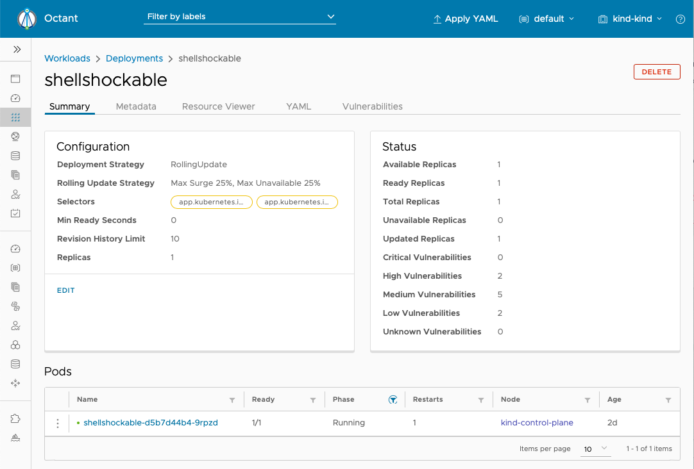

# Vulnerability scanning

The Shellshock vulnerability [demonstrated](compromise.md) is a serious vulnerability, but it's just one of thousands of known, exploitable vulnerabilities that range from negligible right up to critical in severity. Most organizations have a policy of not deploying software with known vulnerabilities over a certain severity threshold.

A vulnerability scanner can show you which vulnerabilities are present in your container images. This data can inform policies to prevent deploying vulnerable containers that an attacker could exploit.

There are several solutions for vulnerability scanning available, and in this workshop we will use the open source scanner [Trivy](https://github.com/aquasecurity/trivy).

## Running Trivy locally

Let's start by installing Trivy so we can run it locally.

### Install Trivy

On MacOS using Homebrew:

```
brew install aquasecurity/trivy/trivy
```

On MacOS / Linux:

```
curl -sfL https://raw.githubusercontent.com/aquasecurity/trivy/master/contrib/install.sh | \
     sh -s -- -b /usr/local/bin
```

Trivy does not have a native binary for Windows, but you can [run Trivy as a container](https://github.com/aquasecurity/trivy#docker).

For more details see the [installation instructions](https://github.com/aquasecurity/trivy#installation).

### Scan images with Trivy

To scan an image simply run `trivy image <image>`. For example, to find the vulnerabilities in the image used in the Shellshock-compromised pod, run this:

```
trivy image lizrice/shellshockable:0.1.0
```

The Shellshock vulnerability is classed as HIGH severity, and it has the identifier [CVE-2014-6271](https://cve.mitre.org/cgi-bin/cvename.cgi?name=CVE-2014-6271).

If you are seeing a lot of results you might want to filter out the lower severity results. For example:

```
trivy image --severity=CRITICAL,HIGH,MEDIUM lizrice/shellshockable:0.1.0
```

For comparison, try this version of the image that does not have the Shellshock vulnerability:

```
trivy image --severity=CRITICAL,HIGH,MEDIUM lizrice/shellshockable:0.3.0
```

Now try Trivy on your favourite images!

## Vulnerability scanning in CI/CD

One way to "shift left" security is to include vulnerability scanning as an automatic step in CI/CD. Your build steps might be something like this:

* Compile code
* Run tests
* Build Dockerfile into container image
* Scan image for vulnerabilities
* Push image to container registry

If any step fails, the pipeline is stopped - so if a vulnerability is found, the scanning stage fails, and the image doesn't get pushed to the registry.

Trivy has some settings that make it a great fit in CI/CD systems:

* `--light` downloads a smaller vulnerability database that omits some details such as the text description of each vulnerability
* `--severity=CRITICAL,HIGH,MEDIUM` only checks for vulnerabilities of MEDIUM or higher severity
* `--exit-code=1` returns 1 if any vulnerabilties are found (above the threshold defined by `--severity`). This non-zero exit code is interpreted as a failure by the CI/CD system.

Take a look at [these examples for integrating vulnerability scanning into various CI/CD systems](https://github.com/aquasecurity/trivy#continuous-integration-ci).

## Scanning in admission control

To prevent deploying a container image with known vulnerabilities, you can use an admission controller that either

* scans the image, or
* retrieves the result from a previous scan

and denies admission if the image is vulnerable.

Teppei Fukuda has a [session at KubeCon this week](https://sched.co/Zekd) showing the use of OPA to make policy checks at the admission control stage.

## Scanning in live workloads

Scanning in the CI/CD pipeline can prevent you from storing a vulnerable image in the registry, and admission control can prevent you from deploying an image with known vulnerabilities. But you may also want the ability to check the container images used by your live workloads.

> New vulnerabilities are found all the time. An image that you scan today might not have any vulnerablities, but a researcher may find a new issue that means the same image will fail the scan tomorrow.

[Starboard](https://github.com/aquasecurity/starboard) is a tool for running security tools, including Trivy, within your Kubernetes cluster. This is an easy way to create and view scans of the container images used by your running workloads. Want to give it a try?

### Install Starboard

1. If you don't already have the `krew` plugin manager installed, follow the instructions [here](https://krew.sigs.k8s.io/docs/user-guide/setup/install/)

1. Install Starboard as a kubectl plugin:

```sh
kubectl krew install starboard
```

1. Check that it's working

```sh
kubectl starboard help
```

On Mac you may get warnings about not being able to verify the developer - see [this guide to resolve them](https://github.com/aquasecurity/starboard#starboard-cannot-be-opened-because-the-developer-cannot-be-verified-macos).

1. Initialize Starboard

```sh
kubectl starboard init
```

1. Check that this has created some CRDs

```sh
kubectl get crds
```

### Find vulnerabilities

Starboard uses Trivy to populate some `vulnerabilities` CRs that relate to running workloads. Let's find the vulnerabilities in the deployment we created for the Shellshock demo.

```sh
kubectl starboard find vulns --delete-scan-job=false deployment/shellshockable
```

This will take a few seconds. The `--delete-scan-job=false` parameter allows us to inspect the job that Starboard creates to run Trivy. But first let's look at the results:

```sh
kubectl starboard get vulns deployment/shellshockable
```

This outputs all the vulnerability information (including the details about Shellshock, with ID CVE-2014-6271).

These details have been stored in a `vulns` resource that you can view with a regular `kubectl get` command:

```sh
kubectl  get vulns --show-labels
```

The output should look something like this:

```
NAME                                   AGE     LABELS
c9b156db-ab92-4b32-a006-efc54312a8c1   4m14s   starboard.container.name=shellshockable,starboard.resource.kind=Deployment,starboard.resource.name=shellshockable,starboard.resource.namespace=default
```

The labels indicate which resource this vulnerability report applies to.

> TODO! On master, but not yet released as a binary, we have [additional info](https://github.com/aquasecurity/starboard/pull/97) with `-o wide`

As mentioned above, Starboard creates a Kubernetes job that runs Trivy over the container images defined for the workload. This job lives in a namespace called *starboard*. In this example, the job finds that the `shellshockable` deployment uses the container image `lizrice/shellshockable:0.1.0`, and runs Trivy over that image. If you specified `--delete-scan-job=false` you can inspect the completed job.

```sh
kubectl describe $(kubectl get jobs -n starboard -o name) -n starboard
```

Within this output you can see that the job ran the `trivy` command, and the last argument to that command was the image name `lizrice/shellshockable:0.1.0`.
```
...
  Containers:
   shellshockable:
    Image:      docker.io/aquasec/trivy:0.9.1
    Port:       <none>
    Host Port:  <none>
    Command:
      trivy
    Args:
      --skip-update
      --cache-dir
      /var/lib/trivy
      --no-progress
      --format
      json
      lizrice/shellshockable:0.1.0
...
```

### View in Octant

Starboard makes it easy to run Trivy over your running workloads, and coming soon, there will be an [operator](https://github.com/aquasecurity/starboard-security-operator) that will watch for new workloads and automatically run scans over them.

Today, there is also an Octant plugin so you can view the vulnerability results through the Octant UI.



You can check out the instructions for this [here](https://github.com/aquasecurity/starboard-octant-plugin#starboard-octant-plugin) if you want to try it out.
