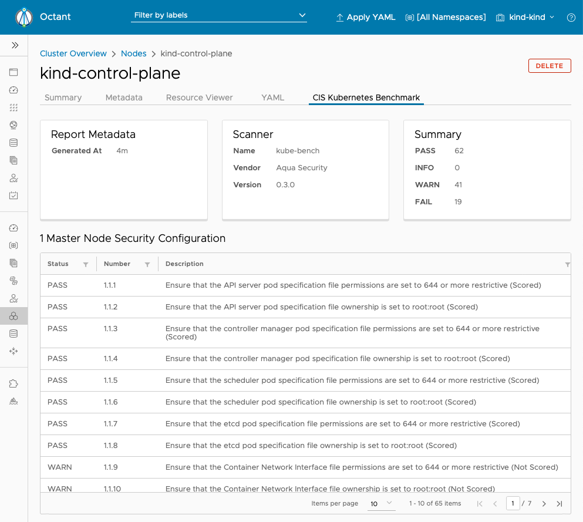

# Using secure Kubernetes settings

When you install Kubernetes, there are numerous configuration settings that can affect security. In this section you'll learn about checking the settings in your cluster against the best practices advised by the Center for Internet Security.

## The CIS Kubernetes Benchmark

The CIS have many different benchmarks recommending how to configure software components with security best practices in mind. One such benchmark is for Kubernetes - in fact there are several editions for managed version of Kubernetes, like EKS or GKE, as well as for upstream Kubernetes installations.

There are hundreds of recommendations in these benchmarks, so running them manually on every node would be a time-consuming process.

### Running benchmark checks with kube-bench

The open source tool [kube-bench](https://github.com/aquasecurity/kube-bench) makes it easy to run the tests defined in the CIS Kubernetes benchmark. In this tutorial, you will use kube-bench to identify some insecure Kubernetes settings, and you'll remediate one of the settings to turn a failing test into a pass.

You could run `kube-bench` in a cluster of your choice but for this tutorial we are showing it running in a kind (Kubernetes in Docker) single-node cluster that runs on your laptop as a Docker container.

## Run kube-bench in kind

!!! danger

    What we are about to do is TERRIBLE practice but it makes it easier to write a platform-independent set of instructions for this tutorial. Never run YAML directly from the internet like this in your production cluster - check what's in it first!

### Create kube-bench job

```
kubectl apply -f https://raw.githubusercontent.com/aquasecurity/kube-bench/master/job.yaml
```

You can watch the job until it has completed:

```
kubectl get jobs --watch
```

Hit Ctrl-C once the job has finished.

### Get job output from logs

The job applies the label `app: kube-bench` to the pod, so you can easily retrieve the logs like this:

```
kubectl logs $(kubectl get pods -l app=kube-bench -o name)
```

Scroll back through the logs to see how it is divided into sections, each with its own set of results, remediation recommendations, and a summary.

Most of the tests pass but there are a few results marked with `[WARN]` or `[FAIL]`

* `[FAIL]` means that the test failed
* `[WARN]` indicates that you need to do something manually to verify whether the test should pass or not.

For more detail on the output check the [kube-bench documentation](https://github.com/aquasecurity/kube-bench#output).

## Remediate a test

!!! note
    This tutorial was written using Kubernetes 1.18.2 and testing against the CIS Kubernetes Benchmark v1.5.1. If you are using a later version of Kubernetes, it's possible that the default configuration settings have changed and the results you get might not match what is described here.

Scroll back through the results to find the result and (further down the results) the remediation information for the test 4.2.6.

```
...

[FAIL] 4.2.6 Ensure that the --protect-kernel-defaults argument is set to true (Scored)

...

4.2.6 If using a Kubelet config file, edit the file to set protectKernelDefaults: true.
If using command line arguments, edit the kubelet service file
/etc/systemd/system/kubelet.service.d/10-kubeadm.conf on each worker node and
set the below parameter in KUBELET_SYSTEM_PODS_ARGS variable.
--protect-kernel-defaults=true
Based on your system, restart the kubelet service. For example:
systemctl daemon-reload
systemctl restart kubelet.service
```

Kind uses a kubelet configuration file that lives at `/var/lib/kubelet/config.yaml`, so only the first line of the remediation text applies - you don't have to worry about editing the kubelet service file or restarting the service.

!!! note
    When using kind, there is a Docker container running your control plane. This image for this container is based on Ubuntu so we can exec into the running container and then treat it much as if it were a virtual machine running a Kubernetes node.

### Edit kubelet configuration

First, open a shell into the kind container.

```
docker exec -it kind-control-plane bash
```

Assuming that it doesn't already have an editor installed, you can add one.

```
apt-get update
apt-get install vim
```

Edit the Kubelet config file

```
vi /var/lib/kubelet/config.yaml
```

Add the line `protectKernelDefaults: true` so that the file looks something like this:

```
apiVersion: kubelet.config.k8s.io/v1beta1
authentication:
  anonymous:
    enabled: false
...
nodeStatusUpdateFrequency: 0s
protectKernelDefaults: true
rotateCertificates: true
...
```

Save the file. The kubelet will spot that the configuration has changed and update itself, but meanwhile you can `exit` to leave the container so that you are back at your terminal where you can run `kubectl` commands on the kind cluster.

### Re-run kube-bench

First delete the previous job:

```
kubectl delete job kube-bench
```

Run the kube-bench job, as before:

```
kubectl apply -f https://raw.githubusercontent.com/aquasecurity/kube-bench/master/job.yaml
```

Once the job has completed, get the test results from the logs

```
kubectl logs $(kubectl get pods -l app=kube-bench -o name)
```

This time you should see that test 4.2.6 passes. Congratulations, you have remediated a security setting on a Kubernetes node!

!!! note
    This only remediates the running node, of course! If you are managing your own Kubernetes nodes, it would be better to update the configuration settings you use in deployment scripts, so that the nodes are configured to run from the outset with the settings you want.

## Using kube-bench via Starboard

You can also use Starboard to run kube-bench and store the results in a Kubernetes CRD.

```sh
$ kubectl starboard kube-bench
$ kubectl get ciskubebenchreports -o yaml
```

These results can be easily viewed using Octant and the Octant Starboard plugin.

Using Starboard has the advantage that it will automatically run a `kube-bench` job on all the nodes in the cluster.




## Optional exercises

If you download the [`job.yaml`](https://raw.githubusercontent.com/aquasecurity/kube-bench/master/job.yaml) file used above, you can modify it to try some optional exercises.

### Run a specific test

Sometimes you might want to run an individual test rather than the whole benchmark. For example, try to modify the command run in the job so that it only runs the test 4.2.6 that you remediated earlier. You can do this by specifying `--check=4.2.6` as a parameter to the `kube-bench` command.

### Specify worker node tests only

There are different CIS Kubernetes Benchmark tests for different node types in the cluster (control plane nodes, worker nodes, etcd nodes). On a managed Kubernetes system you might only have access to worker nodes, so you only need to run the tests that apply to those nodes. `kube-bench` tries to auto-detect which tests to run on any given node, but to keep things simple you may wish to specify worker node tests only. You might like to try out the [`job-node.yaml`](https://raw.githubusercontent.com/aquasecurity/kube-bench/master/job-node.yaml) configuration which does just that.

